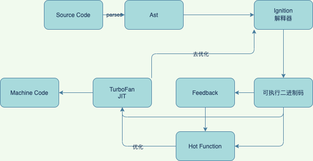
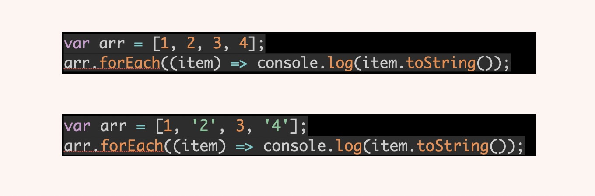
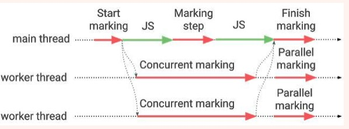

# V8
## 运行流程	


## 优化
----
### 优化与去优化

### 优化
- 在 JavaScript 引擎中增加一个监视器（也叫分析器）。记录代码一共运行了多少次、如何运行的等信息，标记为warm、hot。
- warm：那么 JIT 就把它送到基线编译器去编译，并且把编译结果存储起来。比如，监视器监视到了，某行、某个变量执行同样的代码、使用了同样的变量类型，那么就会把优化编译后的版本，替换这一行代码的执行，并且存储（保存AST生成的机器码）。
- hot：JIT 会把它发送到优化编译器中。生成一个更快速和高效的代码版本出来，并且替换。例如：循环加一个对象属性时，假设它是 INT 类型，优先做 INT 类型的判断
-  如果函数没有被调用，则V8不会去编译它。
-  如果函数只被调用1次，则Ignition将其编译Bytecode就直接解释执行了。TurboFan不会进行优化编译，因为它需要Feedback收集函数执行时的类型信息。
-  这就要求函数至少需要执行1次，TurboFan才有可能进行优化编译。
-  如果函数被调用多次，则它有可能会被识别为热点函数，且Feedback收集的类型信息证明可以进行优化编译的话，这时TurboFan则会将Bytecode编译为Optimized Machine Code，以提高代码的执行性能。
   
### 去优化
#### 当被优化的代码不在适用时，将重新从Ignition中新的编译一份出来覆盖

----
### 隐藏类和内联类
### 隐藏类
- 为了加快对象属性和方法在内存中的查找速度，V8引擎引入了隐藏类(Hidden Class)的机制，起到给对象分组的作用。
- 在初始化对象的时候，V8引擎会创建一个隐藏类，随后在程序运行过程中每次增减属性，就会创建一个新的隐藏类或者查找之前已经创建好的隐藏类。
- 每个隐藏类都会记录对应属性在内存中的`偏移量`，从而在后续再次调用的时候能更快地定位到其位置。

### 内联类
#### 内联缓存：每次调用对象上的方法或属性的时候先查询缓存，如果命中则直接使用缓存结果。如果未命中，就查询隐藏类来获取结果。

- 根据入参类型的不同动态的拿取缓存好的方法去执行

----

## GC
### V8 中会把堆分为新生代和老生代两个区域，新生代中存放的是生存时间短的对象，老生代中存放的生存时间久的对象。
### 新空间、老生代、大对象空间、代码空间、单元空间

### 新生代算法，Scavenge
- 把新生代空间对半划分为两个区域，一半作为对象区域，一半为空闲区域
- 新加入的对象都会存放到对象区域，当对象区域快被写满时，就需要执行一次垃圾清理操作。
- 检查对象区域的存活对象，移到空闲区域；
- 清除完毕之后，清空原对象区域，交换对象区域和空闲区域
- 缺点是只能使用堆内存中的一半，但是时间效率上有着优异的表现

### 新生代晋升
- 对象使用超过25%的空间时直接晋升
- 对象经过了一次Scacenge回收后在第二次时

### 老生代算法，Mark-Sweep 和 Mark-Compact

### Mark-Sweep
标记清除法主要分三步：

1. 标记：第一步，两种算法都通用，其中垃圾回收器标识哪些对象正在使用，哪些对象未在使用。递归地从GC根（栈指针）中使用中或可访问的对象被标记为活动的。从技术上讲，这是对堆的深度优先搜索，可以看作是有向图。
2. 清理：垃圾回收器遍历堆并记录任何未标记为活动的对象的内存地址。这些空间现在在空闲列表中被标记为空闲，可用于存储其他对象。
3. 压缩（Mark-Compact）：清理后，如果需要，将所有剩下的对象移动到一起。这将减少碎片并提高向较新对象分配内存的性能。
<!-- 
将所有的指针（变量名）和分配出去的内存打上标记。
从栈区开始查找所有可用的变量名，清除这些变量名的标记，并且清除它们指向的内存的标记。
标记清除结束后，回收所有仍然带有标记的内存（说明没有一个有效的变量名指向这块内存）。
经历过一次 Mark-Sweep （标记清楚）之后，内存的空间将会变得不连续，这样会对后续内存分配造成问题；与Mark-Sweep是对未标记的对象立即进行回收，Mark-Compact则是将存活的对象移动到一边，然后再清理端边界外的内存。 -->

### Incremental Marking（增量标记）
#### 解决老生代full mark的时间太长的问题
- 将标记拆成许多小步，步之间执行逻辑；交替完成

### lazy sweeping （延迟清理）
- 与`Incremental Marking`同理

Write barrier：原子性;保释清单：将标记的工作权限交给主线程；改对象布局

### 补充,并发标记
- 在增量标记期间，垃圾收集器将标记工作分解为更小的块，并且允许应用程序在块之间运行； 
- 但是对内存压力较大的堆，收集器仍然可能出现长时间的暂停来维持分配。增量标记不是没有代价的。步之间执行逻辑完成后，应用程序必须通知垃圾收集器关于改变对象图的所有操作。
- 并发标记允许 JavaScript 在主线程上运行，而工作线程正在访问堆上的对象。这为潜在的竞态数据打开大门。主线程的每个改变对象图表的操作将会是竞态数据的潜在来源。由于 V8 是具有多种对象布局优化功能的高性能引擎，潜在竞态数据来源目录相当长。因此引出了原子性和保释清单；
- 主线程通过扫描 roots 并填充标记工作表来启动标记。之后，它会在工作线程上发布并发标记任务。
- 工作线程通过合作清空（draining）标记工作表以加快主线程标记进度。主线程偶尔也会通过处理保释清单和标记工作表参与标记。
- 标记工作表变空后，主线程完成 GC。
- 在最终确定清除之前，主线程重新扫描 roots ，可能会发现更多需清除项，这些对象在工作线程的帮助下被平行标记。
- 到此并发标记彻底完成
  
### GC大致流程图



### 为什么要用字节码呢？
- 编译过程中做了一个空间(编译执行)和时间(解释执行)上的权衡的中间代码(既要快，又要小)。
  - 机器码占用太大
  - 热力代码被优化，从字节码编译成二进制代码执行，字节码比较接近机器码所以优化速度较快
  - 字节码被解释器编译的速度更快增加了启动速度，同时执行速度只不过比机器代码稍慢。
- 不同 cpu 处理器因平台不同所以机器代码不同，字节码与机器代码执行流程接近因此降低了编译器将字节码转换机器代码的时间。

### 什么原因造成的变量提升？
- 所有表达式都是编译阶段创建变量并赋值 undefined 提升到作用域中，
- 语句则在执行阶段触发，此时会从作用域中查询变量。
- 函数声明虽然是一个语句，但是 也有提升
  - V8 会在内存中创建该函数对象，并提升整个函数对象，而不是赋值成 undefined。

### v8 闭包处理
- 预解析器，先对上面的 code 进行一个粗略的预解析:
  - 遇到语法错误就抛出。
  - 遇到闭包会把外部变量从栈复制到堆中，下次直接使用堆中引用（以防执行先后顺序导致闭包引用的变量已经出栈被回收）

### V8 对象属性访问
```ts
function yyz() {
  this['A'] = 'A'
  this[0] = '2'
  this['1'] = 3
  this[2] = '4'
  this['handsome'] = 5
  this[7.7] = 7.7
  this[888] = '6'
  this['B'] = 'B'
}

const handsomeBoy = new yyz()

for (let key in handsomeBoy) {
  console.log(`${key}:${handsomeBoy[key]}`)
}
// 0:2
// 1:3
// 2:4
// 888:6
// A:A
// -1:1
// handsome:5
// 7.7:7.7
// B:8
```

- 在 V8 的对象中有分俩种属性，排序属性以（elements）及常规属性（properties），
- 数字被分类为排序属性，字符串属性就被称为常规属性，
- 排序属性按照数字大小升序而常规属性按照创建升序，
- 执行顺序也是先查 elements 再查找 properties。

#### 对象内属性
- 小于10个属性，直接保存在对象内，直接生成映射，快速查找

#### 快属性
- 大于 10 个，在 properties 下按创建顺序存放（0、1）。需要额外多一次 properties 的寻址时间，之后便是与对象内属性一致的线性查找
- 大于20个，不再是线性查找，而是变为散列表
  
####
- 排序顺序数字按大小排序->字符串按先后执行顺序排序
- 数字存储在排序属性，字符串存储在常规属性
- 10 个及 10 个以内会在内部生成属性
- 大于十个在 properties 里线性存储
- 数量大的情况改为散列表存储