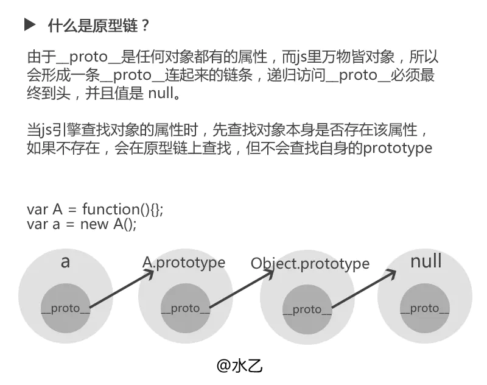
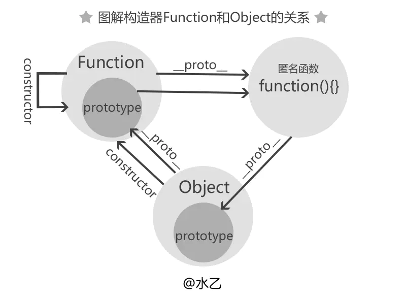
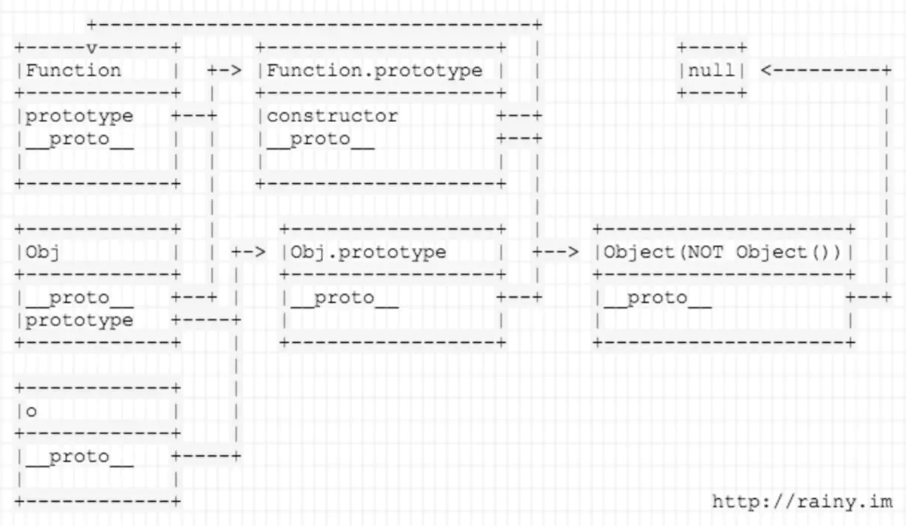
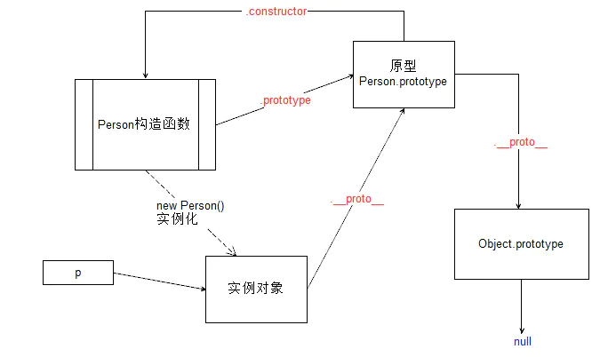

# 原型和原型链

## 原型
### 函数才有的属性
- 每个函数都有prototype(原型)属性，这个属性是一个指针，指向一个对象，这个对象的用途是包含特定类型的所有实例共享的属性和方法
- 而每个实例内部都有一个指向原型对象的指针。

## 原型链
- 每个构造函数都有一个原型对象，原型对象都包含一个指向构造函数的指针，而实例都包含指向原型对象内部的指针。我们让原型对象的实例（1）等于另一个原型对象（2）,


## __proto__
- 每个对象都有的属性
- 大多情况下可以理解为构造器的原型（`__proto__ === constructor.prototype`）
- `Object.prototype.__proto__` === null




1. 所有的构造器的constructor都指向Function

2. Function的prototype指向一个特殊匿名函数，而这个特殊匿名函数的proto指向Object.prototype



## 构造函数 对象原型链结构图
### EX： function Person (){}; var p = new Person();


## 属性搜索原则
1. 所谓的属性搜索原则, 就是对象在访问属性与方法的时候, 首先在当前对象中查找,找到停止
2. 如果对象没有改成员, 那么再其原型对象中查找,找到停止
3. 如果原型还没有, 就到原型的原型中查找
4. 如此往复, 直到直到 Object.prototype 还没有, 那么就返回 undefind.
5. 如果是调用方法就包错, 该 xxxx 不是一个函数

```ts
// EX
function Foo() {};

let f1 = new Foo();
let f2 = new Foo();
let o1 = new Object();
let o2 = new Object();

f1.__proto__ === Foo.prototype === f2.__proto__;
f1.__proto__.__proto__ === Object.prototype ;
f1.__proto__.__proto__.__proto__ === null ;
f1.constructor === Foo.prototype.constructor === Foo;
Foo.prototype.__proto__ === Object.prototype; 
Object.prototype.__proto__ === null; 
Object.prototype.constructor === Object; 
Object.__proto__ === Function.prototype; 
Function.prototype.__proto__ === Object.prototype; 
Function.__proto__ === Function.prototype = f() {}; 
Foo.__proto__ === Function.prototype;
o1.__proto__ === Object.prototype;
```


### 一个小问题
#### eslint 推荐使用下面的那种写法
```ts

let a = new Object();
a.a = 1;

a.hasOwnProperty('a')
Object.hasOwnProperty.call(a, 'a')

```
#### 因为没法保证a的来源，举例a是{},他就没有hasOwnProperty

## 总结
- Object 是所有对象的爸爸，所有对象都可以通过 __proto__ 找到它
- Function 是所有函数的爸爸，所有函数都可以通过 __proto__ 找到它
- Function.prototype 和 Object.prototype 是两个特殊的对象，他们由引擎来创建
- 除了以上两个特殊对象，其他对象都是通过构造器 new 出来的
- 函数的 prototype 是一个对象，也就是原型
- 对象的 __proto__ 指向原型， __proto__ 将对象和原型连接起来组成了原型链


Function.prototype === Function.__proto__
Object.__proto__ === Function.prototype
Object.prototype.__proto__ === null