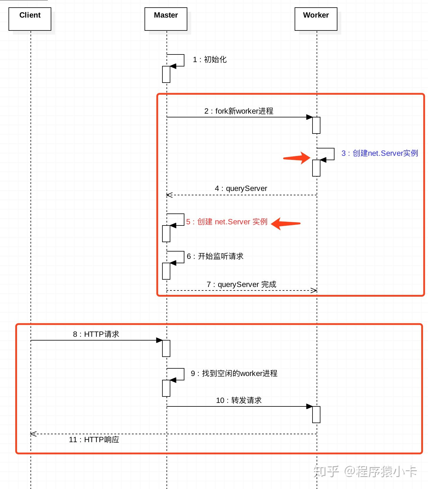

# cluster

### 示例
```js
const cluster = require('cluster');
const http = require('http');
const numCPUs = require('os').cpus().length;

if (cluster.isMaster) {
  console.log(`主进程 ${process.pid} 正在运行`);

  // 衍生工作进程。
  for (let i = 0; i < numCPUs; i++) {
    cluster.fork();
  }

  cluster.on('exit', (worker, code, signal) => {
    console.log(`工作进程 ${worker.process.pid} 已退出`);
  });
} else {
  // 工作进程可以共享任何 TCP 连接。
  // 在本例子中，共享的是 HTTP 服务器。
  http.createServer((req, res) => {
    res.writeHead(200);
    res.end('你好世界\n');
  }).listen(8000);

  console.log(`工作进程 ${process.pid} 已启动`);
}
```
## 子主进程识别标识`NODE_UNIQUE_ID`
- 当调用cluster.fork( )生成一个子进程时会以一个自增ID的形式生成这个环境变量。

## cluster.fork
1. 设置主线程参数
2. 传入一个自增参数id(就是前文提到的NODE_UNIQUE_ID)和环境信息env来生成一个worker线程的process对象
3. 将id和新的process对象传入Worker构造器生成新的worker进程实例
4. 在子进程的process对象上添加了一些事件监听
5. 在cluster.workers中以id为键添加对子进程的引用
6. 返回子进程worker实例

# IPC通道实现通讯
## `process.send`
## Manager类
- Manager类的实例在master进程中工作，用于初始化一个Object作为共享内存，
- 并根据User实例的请求，在共享内存中增加键值对，或者读取键值，然后将结果发送回去。

```js
var Manager = function() {
    var self = this;
    // 初始化共享内存
    self.__sharedMemory__ = {};
    // 监听并处理来自worker的请求
    cluster.on('online', function(worker) {
        worker.on('message', function(data) {
            // isSharedMemoryMessage是操作共享内存的通信标记
            if (!data.isSharedMemoryMessage) return;
            self.handle(data);
        });
    });
};

Manager.prototype.handle = function(data) {
    var self = this;
    var value = this[data.method](data);

    var msg = {
        // 标记这是一次共享内存通信
        isSharedMemoryMessage: true,             
        // 此次操作的唯一标示
        uuid: data.uuid,
        // 返回值
        value: value
    };

    cluster.workers[data.id].send(msg);
};

// set操作返回ok表示成功
Manager.prototype.set = function(data) {
    this.__sharedMemory__[data.key] = data.value;
    return 'OK';
};

// get操作返回key对应的值
Manager.prototype.get = function(data) {
    return this.__sharedMemory__[data.key];
};

```

# 实现端口的共享
- master进程：在该端口上正常监听请求。（没做特殊处理）
- worker进程：创建server实例。
  - 通过IPC通道，向master进程发送消息，让master进程也创建 server 实例，并在该端口上监听请求。
  - 当请求进来时，master进程将请求转发给worker进程的server实例。


# 如何将请求分发到多个worker
- 由转发策略决定，可以通过环境变量`NODE_CLUSTER_SCHED_POLICY`设置，也可以在`cluster.setupMaster(options)`时传入。
- 默认的转发策略是轮询（SCHED_RR）。


# 进程通讯
- Node进程间通信有4种方式：
1. Node原生IPC支持：最native的方式
2. 通过sockets：最通用的方式，有良好的跨环境能力，但存在网络的性能损耗
3. 借助message queue：最强大的方式，既然要通信，场景还复杂，不妨扩展出一层消息中间件，漂亮地解决各种通信问题