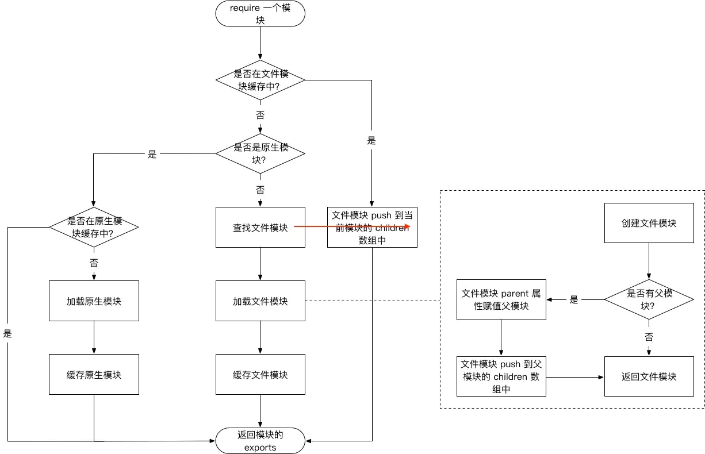

# CommonJS规范
## 引用
- 模块上下文提供require()方法来引入外部模块，

## 定义
- 模块中存在一个module对象，它代表模块自身，exports是module的属性。
- `exports.add`、`module.exports.add`

## 模块标识
- 模块标识就是传递给require()方法的参数，它必须是符合小驼峰命名的字符串，或者以.、..开头的相对路径或者绝对路径，可以没有文件后缀名.js.

# Node的模块实现
## 路径分析
- 模块的引用会映射到一个js文件路径
- 核心模块（内置模块），在Node进程开始的时候就预加载了。
- 文件模块，每个模块都会暴露一个公开的API
- 核心模块是Node源码在编译过程中编译进了二进制执行文件。在Node启动时这些模块就被加载进内存中，所以核心模块引入时省去了文件定位和编译执行两个步骤，并且在路径分析中优先判断，因此核心模块的加载速度是最快的。文件模块则是在运行时动态加载，速度比核心模块慢。
### 注意事项
1. Node的内置模块被编译为二进制形式，引用时直接使用名字而非文件路径。当第三方的模块和内置模块同名时，内置模块将覆盖第三方同名模块。
2. 允许忽略扩展名
3. 载入文件目录模块，此时，Node将搜索整个folder目录，Node会假设folder为一个包，之后依次去找`package.json`,`index.js`，都不存在那么加载将失败。
4. 载入node_modules里的模块，排除上面两种情况后会试图去寻找，当前目录的node_modules文件夹里搜索，递归向更目录找
5. 自动缓存已载入模块
6. 优先从缓存加载

## 文件定位
- 文件扩展名分析，Node会按.js、.json、.node的顺序补足扩展名，依次尝试。fs模块阻塞式地判断文件是否存在
- 目录分析和包，不是文件；在当前目录下查找package.json，通过JSON.parse()解析出包描述对象，从中取出main属性指定的文件名进行定位。若main属性指定文件名错误，或者没有pachage.json文件，Node会将index当作默认文件名。

- 

## 编译执行
```js
function Module(id, parent) {
    this.id = id;
    this.exports = {};
    this.parent = parent;
    if(parent && parent.children) {
        parent.children.push(this);
    }
    this.filename = null;
    this.loaded = false;
    this.children = [];
}
```
- 每一个编译成功的模块都会将其文件路径作为索引缓存在Module._cache对象上。
- Module._extensions会被赋值给require()的extensions属性，所以可以用:console.log(require.extensions);输出系统中已有的扩展加载方式。 
  - 当然也可以自己增加一些特殊的加载:
   ```js
   //官方不鼓励
   require.extensions['.txt'] = function(){
		//code
	};。
   ```
### js模块的编译 
  - 在编译的过程中，进行了头尾包装,将文件内容包装在一个function中,
  - 通过vm原生模块的runInThisContext()方法执行,返回一个具体的function对象，最后传参执行，执行后返回module.exports.
	- runInThisContext: 具有明确上下文，不污染全局
### 核心模块编译
1. 转成c/c++
  - 所有内置的JavaScript代码转换成C++里的数组，生成node_natives.h头文件
  - 在这个过程中，JavaScript代码以字符串形式存储在node命名空间中,是不可直接执行的。
  - 在启动Node进程时，js代码直接加载到内存中。在加载的过程中，js核心模块经历标识符分析后直接定位到内存中。
2. 编译js核心模块
   - 也会被头尾包装，只是源代码的获取方式（内存）和执行结果缓存位置（`NativeModule._cache`）不同
## 加入内存

# import和require
- import是静态加载模块，require是动态加载
- require值拷贝，es值引用

# nodejs清除require缓存
```js
	delete require.cache[require.resolve('./server.js')];
	app = require('./server.js');
```

