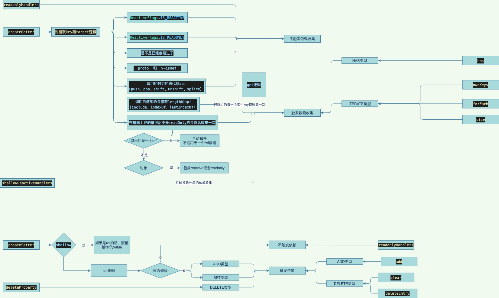

# baseHandlers & collectionHandlers

## baseHandlers

### createGetter
#### 重点是track的时机
#### 这里只列出get和set这两个handler

```ts
function createGetter(isReadonly = false, shallow = false) {
  return function get(target: Target, key: string | symbol, receiver: object) {
    // 0、拦截 ReactiveFlags.IS_REACTIVE key读取，实现该功能
    // 能进入这个方法就代表是reactive了，判断是不是readonly

    // 1、拦截 RReactiveFlags.IS_READONLY key读取，实现该功能

    // 2、读取reactive的源值，如果已经创建了则返回

   // 3、属于数组的api调用则分两种情况
   // 3.1、'includes', 'indexOf', 'lastIndexOf'收集每一项的依赖
   // 3.2、'push', 'pop', 'shift', 'unshift', 'splice'，在执行这些api的时候停止收集`pauseTracking`,执行完了在回到之前的状态
   // 因为这些api执行完之后会触发length的收集，不重复收集；数组取完值之后return

   // 4、过滤调__proto__、 __v_isRef还有isSymbol的一些api，不收集

   // 5、不是只读则收集

   // 6、取到ref则解一层

   // 7、取到对象则封装成readonly或者reactive
  }
}

```

### createSetter
#### 重点是track的时机

```ts
function createSetter(shallow = false) {
  return function set(
    target: object,
    key: string | symbol,
    value: unknown,
    receiver: object
  ): boolean {
    // 0、要赋值的key 是一个ref，则赋值给ref.value

    // 1、如果是修改原值则不触发，tirrger；或者说改变了的原始值的地址

    // 2、key不存在 触发TriggerOpTypes.ADD收集

    // 3、修改时，需要排除未改变的情况
    // 数组增加元素时，会触发length改变，但在达到length修改的set时
    // 数组已经添加元素成功，取到的oldValue会与value相等，直接过滤掉此次不必要的trigger
  }
}

```

## collectionHandlers

### collection 类型的proxy只监听get就好了，因为Set, Map, WeakMap, WeakSet这几个类型正常操作都是通过它内置的api来实现的
### 执行具体api的时候在更具api类型惊喜track或者trigger

### get 方法
- 首先获取 target ，对 target 进行 toRaw， 这个会被 createInstrumentationGetter 中的 proxy 拦截返回原始的 target，
- 然后对 key 也进行一次 toRaw, 如果两者不一样，说明 key 也是 reative 的， 对 key 和 rawkey 都进行 track 否则只对 rawKey做收集
- 然后调用 target 原型上面的 has 方法，如果 key 为 true ，调用 get 获取值，同时对值进行 wrap 

### set 方法
#### set 方法是针对 map 类型的，从 this 的类型我们就可以看出来了， 同样这里我们也会对 key 做两个校验
- 第一，是看看现在 map 上面有没有存在同名的 key，来决定是触发 SET 还是 ADD 的 trigger
- 第二，对于开发环境，会进行 checkIdentityKeys 检查

### clear 方法
#### 与set类似，但是注意size为0时clear不触发

### forEach 方法
#### 在调用 froEach 方法的时候会触发 ITERATE 类型的 track，需要注意 Size 方法也会同样类型的 track，毕竟集合整体的变化会导致整个两个方法的输出不一样。
#### 顺带提一句，还记得我们的 effect 时候的 trigger 吗，对于 SET | ADD | DELETE 等类似的操作，因为会导致集合值得变化，所以也会触发 ITERATE_KEY 或则 MAP_KEY_ITERATE_KEY 的 effect 重新收集依赖。

-----

## 简单流程

