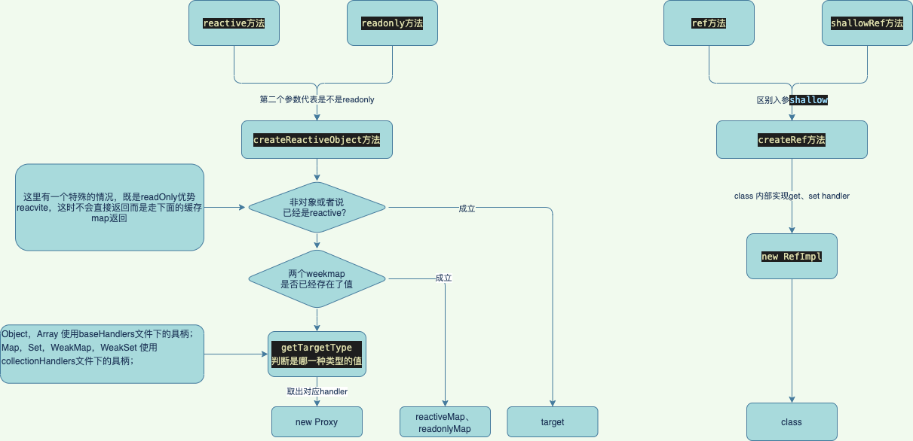

# [Reactive](https://v3.cn.vuejs.org/api/basic-reactivity.html#reactive)
#### reactive 是 vue3 中对数据进行劫持的核心，主要是利用了 Proxy 进行劫持，相比于 Object.defineproperty 能够劫持的类型和范围都更好，再也不用像 vue2 中那样对数组进行类似 hack 方式的劫持了。

## 对象标记
#### 给每一个target打一个状态

```typescript
// 对象类型分类用于区别处理数据的方式
const enum TargetType {
  INVALID = 0,
  COMMON = 1,
  COLLECTION = 2
}
// ReactiveFlags 是 proxy 上的一些常量的定义。
// 对于 target 类型的判断，在 createReactiveObject 中对于 COMMON 和 COLLECTION 有不同的 handlers 来处理。
export const enum ReactiveFlags {
  SKIP = '__v_skip', //+ 跳过reactive
  IS_REACTIVE = '__v_isReactive', //+ 是否是reactive对象
  IS_READONLY = '__v_isReadonly', //+ 是否是只读
  RAW = '__v_raw' //+ 源对象
}

export interface Target {
  [ReactiveFlags.SKIP]?: boolean
  [ReactiveFlags.IS_REACTIVE]?: boolean
  [ReactiveFlags.IS_READONLY]?: boolean
  [ReactiveFlags.RAW]?: any
}

```

#### 分类
- `Object`，`Array` 属于 `TargetType.COMMON`
- `Map`，`Set`，`WeakMap`，`WeakSet` 属于 `TargetType.COLLECTION`
- 其他情况 属于 `TargetType.INVALID`，无效，只对上述类型进行proxy处理
-----
## reactive解析

### 直接看reactive方法
#### 首先判断入参，判断传入的target是不是带有readonly(`ReactiveFlags.IS_READONLY`)的key
#### 需要注意的是vue不会给对象附上这个值，而是在get中进行拦截
```ts
target && (target as Target)[ReactiveFlags.IS_READONLY]
```
#### 创建reactive
- createReactiveObject方法
- 入参：target（值），isReadonly（是否只读），baseHandlers， collectionHandlers后面两个参数是proxy的具柄
- `TargetType.COMMON` 使用baseHandlers具柄；Object，Array 
- `TargetType.COLLECTION` 使用collectionHandlers具柄；Map，Set，WeakMap，WeakSet 
- `TargetType.INVALID` 直接返回
```ts
function createReactiveObject(
  target: Target,
  isReadonly: boolean,
  baseHandlers: ProxyHandler<any>,
  collectionHandlers: ProxyHandler<any>
){
  //0、不是个对象直接return

  //1. target is already a Proxy, return it.
  //如果target是一个只读的reactive，则跳过走下面的readonlyMap；

	// 2. 在reactiveMap和readonlyMap已经保留了，已经创建过了 则直接返回已有的那一份

  // 判断下target是个什么类型，需要注意的是如果对象属于不可修改属性的模式或者是（markRaw）标记了跳过
  // 的部分直接返回target，即!Object.isExtensible(value)，也当作无效值处理
	const targetType = getTargetType(target)

  // 3. INVALID 无效值直接返回
  
  // 4. 根据不同的handler创建不同的proxy，同时把创建的内容存到两个weekMap中去
	// new proxy

}
```
#### proxy存储，单例
- 维护有两个[weekMap](./../../js/map_set.md#weakmap)，`reactiveMap`、`readonlyMap`
- createReactiveObject的值会优先从这两个map中去取，取不到在重新new一个proxy出来

#### isReadonly判断是否是只读
- 核心是判断`ReactiveFlags.IS_READONLY`	的值
- 会被get handler拦截，拦截之后直接返回了true，具体原因间baseHandlers

#### isReactive判断是否为reactive对象
- 核心是判断`ReactiveFlags.IS_REACTIVE`	的值
- 如果是只读则判断他的`ReactiveFlags.RAW`是不是isReactive
- 也会被get handler拦截

#### isProxy判断是否被proxy处理过，上面两个api的集合

#### toRaw取出源对象，递归实现
- 核心是取`ReactiveFlags.RAW`	的值
- 遇到依旧是被proxy包裹的则递归去解

```ts
export function toRaw<T>(observed: T): T {
  // + 解嵌套proxy
  return (
    (observed && toRaw((observed as Target)[ReactiveFlags.RAW])) || observed
  )
}
```
#### markRaw 标记不被reactive
- 给对象的`ReactiveFlags.SKIP`赋值为true
- 
-----

## 简单流程


