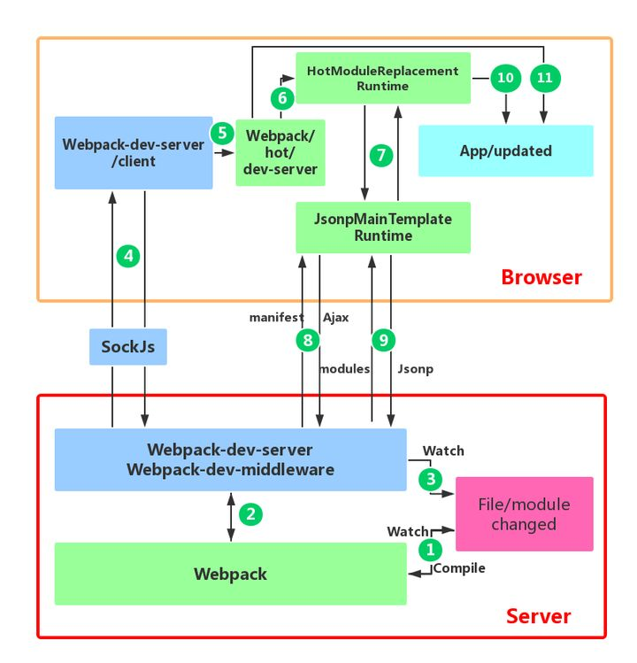

# hmr

## 流程

1. webpack 开启的watch模式监听到了文件的变化，重新打包module，存入内存
2. 通过sockjs 在两端建立链接，将webpack编译打包的各个阶段通知客户端，传递的主要信息还是新模块的hash值（`done`）
3. 客户端根据这些消息进行不同的操作
4. 接收到webpack发出的hash值之后，客户端发一个请求拿到所有要更新的模块的hash值，在决定更新后检查依赖关系，同时更新依赖引用
5. hmr失败则回退到live reload

### webpack-dev-server/client 接收到服务端消息做出响应
- 在什么时候引入了websocket的代码
  - webpack-dev-server 修改了webpack 配置中的 entry 属性，在里面添加了 webpack-dev-client 的代码，这样在最后的 bundle.js 文件中就会有接收 websocket 消息的代码了。
- 接收消息的过程
  - 接收到 type 为 hash 消息后会将 hash 值暂存起来，当接收到 type 为 ok 的消息后对应用执行 reload 操作。
  - 将hash值交给webpack 客户端代码
  
### webpack 接收到最新 hash 值验证并请求模块代码
- 检测是否新的更新，服务端将更新文件列表返回浏览器端
- 通过jsonp请求最新的模块代码，交由HMR处理

### HotModuleReplacement.runtime 对模块进行热更新
1. 找出module和对应的依赖
2. 从缓存中删除这些过去的module，将新module加入
3. 将更新后的代码插入到页面
   

### 服务端部分
- 创建实例
- 启动服务
- 配置中间件，用来提供编译产出的文件的静态文件服务
- 使用`socke.io`在浏览器端和服务端之间建立一个websocket长连接
  - 将 webpack 编译打包的各个阶段的状态信息告知浏览器端，浏览器端更加这些信息进行不同处理
  - 最主要的还是传新的模块hash值，发生hash值
- 添加webpack'done‘时间回调，在编译后向浏览器发消息
- webpack以监听模式开始编译	

### 客户端部分
-  先连socket
-  监听hash
-  上次没有hash（第一次）或者两次一致的话就赋值完事return
-  判断哪些变化了
-  向服务器发ajax，得到一个hot-update.json
-  通过jsonp请求新代码块
-  补丁js取回来后调用webpackHotupdate方法
-  循环该模块所有的parent，在所有用到的地方执行callback 

